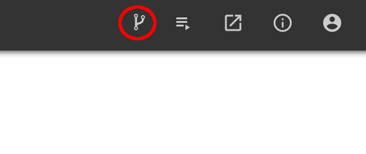
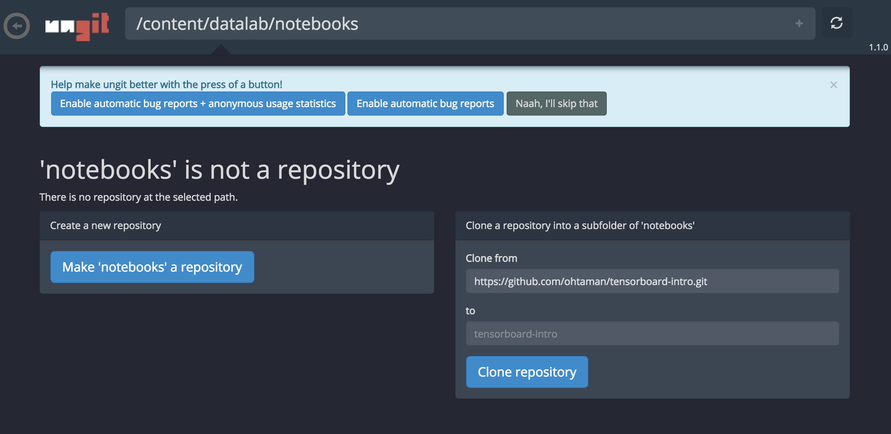

# TensorBoard ~ 活用できていますか ~

Recap of TensorFlow DEV SUMMIT 2017 で披露したデモです。

## 0. 環境

Google Gloud Datalab を想定しています。

### 0-1. Datalab のセットアップ

[Cloud Datalab Quickstart](https://cloud.google.com/datalab/docs/quickstarts) に従って、datalab を起動してください

### 0-2. リポジトリのクローン

datalab の画面右上にある、リポジトリボタンをクリックします

ungitの画面になるので、Clone from に https://github.com/ohtaman/tensorboard-intro.git と入力し、 Clone Repository ボタンをクリックします

datalab 画面にもどり、 tensorboard-intro/ja/ に移動して、上から実行してください。
